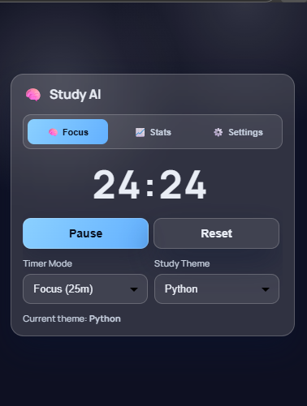
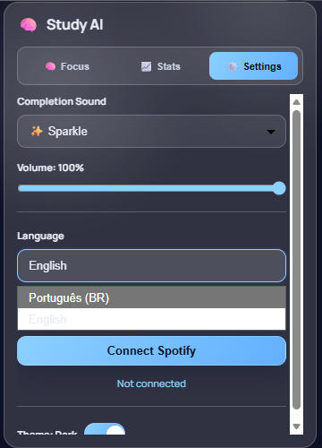
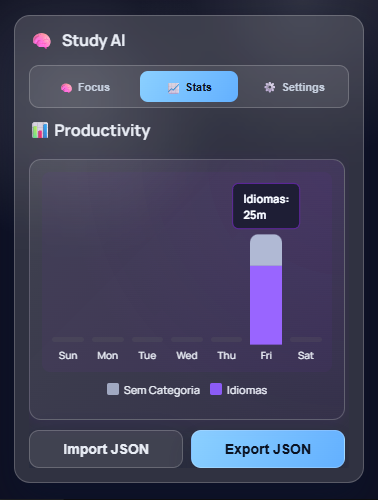

# 🧠 Study AI - Timer Pomodoro Inteligente

<div align="center">


**Um timer Pomodoro desenvolvido com auxílio de IA, focado em produtividade e análise de desempenho.**

[](https://github.com)
[](https://developer.chrome.com/docs/extensions/mv3/)
[](LICENSE)

</div>

---

## 📖 Sobre o Projeto

**Study AI** é uma extensão para Chrome que implementa a técnica Pomodoro com recursos avançados de análise e personalização. O projeto foi desenvolvido com assistência de IA (GitHub Copilot), demonstrando como ferramentas de IA podem acelerar o desenvolvimento de software moderno.
---

## 📸 Demonstração Visual

Aqui está uma prévia da interface e das funcionalidades principais da extensão:

<div align="center">
  <table style="width:100%">
    <tr>
      <td align="center" style="width:50%">
        <strong>⏱️ Timer de Foco</strong><br/>
        
      </td>
      <td align="center" style="width:50%">
        <strong>⚙️ Configurações e Idiomas</strong><br/>
        
      </td>
    </tr>
    <tr>
      <td align="center" colspan="2">
        <br/>
        <strong>📊 Dashboard de Produtividade (Métricas de Estudo)</strong><br/>
        
        <p><em>Acompanhamento detalhado do tempo dedicado por categoria com suporte a i18n.</em></p>
      </td>
    </tr>
  </table>
</div>

---

**Study AI** é uma extensão para Chrome que implementa a técnica Pomodoro com recursos avançados de análise e personalização. O projeto foi desenvolvido com **assistência de IA (GitHub Copilot)**, demonstrando como ferramentas de IA podem acelerar o desenvolvimento de software moderno.

### 🎯 Filosofia de Desenvolvimento

Este projeto é um exemplo prático de desenvolvimento assistido por IA, onde:
- ✅ A arquitetura foi planejada com auxílio de IA
- ✅ Código otimizado e revisado por ferramentas inteligentes
- ✅ Documentação técnica gerada de forma eficiente
- ✅ Debugging acelerado com análise automatizada

---

## ✨ Funcionalidades

### ⏱️ **Timer Pomodoro Completo**
- **3 Modos de Estudo:** Foco (25 min), Pausa Curta (5 min), Pausa Longa (15 min)
- **Controles Intuitivos:** Iniciar, Pausar, Resetar com um clique
- **Persistência de Estado:** Timer continua rodando mesmo fechando o popup
- **Notificações Sonoras:** 4 tipos de sons personalizáveis (Sparkle, Piano, Chime, Bell)
- **Controle de Volume:** Ajuste fino de 0-100% com preview em tempo real

### 📊 **Dashboard de Estatísticas**
- **Gráfico Semanal:** Visualize suas sessões de estudo por dia da semana
- **Análise por Categoria:** Distribua seu tempo entre diferentes áreas de estudo
- **Histórico Completo:** Acompanhe seu progresso ao longo do tempo
- **Export/Import de Dados:** Backup completo em formato JSON

### 🎨 **Personalização**
- **Temas:** Modo claro e escuro
- **Categorias Customizáveis:** Crie categorias para organizar seus estudos
- **Sons de Notificação:** Escolha entre 4 sons com síntese Web Audio API
- **Interface Responsiva:** Design glassmorphism moderno e clean

### 🎵 **Integração Spotify** *(em desenvolvimento)*
- Autenticação OAuth 2.0
- Controles de reprodução direto no timer
- Sincronização com suas playlists

### ⚡ **Quick Start Spotify**
1. Crie um app no Spotify Developer Dashboard.
2. Configure a Redirect URI da extensão (`chrome.identity.getRedirectURL()`).
3. Informe o Client ID em **Configurações > Spotify** no popup.
4. Clique em **Conectar Spotify** e autorize.
5. Abra o Spotify em algum dispositivo para usar play/pause/next/prev.

Documentação completa:
- [docs/SPOTIFY_INTEGRATION.md](docs/SPOTIFY_INTEGRATION.md)
- [docs/MESSAGE_CONTRACT.md](docs/MESSAGE_CONTRACT.md)

---

## 🚀 Tecnologias Utilizadas

### Frontend
- **HTML5 + CSS3:** Interface moderna com Glassmorphism
- **JavaScript (ES6+):** Lógica assíncrona e event-driven
- **Chart.js:** Visualização de dados interativa

### Chrome APIs (Manifest V3)
- **Service Worker (background.js):** Timer persistente em background
- **Offscreen Documents:** Reprodução de áudio (Web Audio API)
- **Chrome Storage API:** Persistência local de dados
- **Chrome Identity API:** OAuth 2.0 para Spotify

### Síntese de Áudio
- **Web Audio API:** Geração de tons com envelope ADSR
- **Offscreen Documents:** Compatibilidade com Manifest V3

---

## 📦 Instalação

### **Método 1: Instalar como Extensão no Modo Desenvolvedor**

1. **Clone o repositório:**
   ```bash
   git clone https://github.com/seu-usuario/study-ai.git
   cd study-ai
   ```

2. **Abra o Chrome e acesse:**
   ```
   chrome://extensions/
   ```

3. **Ative o Modo do desenvolvedor** (toggle no canto superior direito)

4. **Clique em Carregar sem compactação**

5. **Selecione a pasta do projeto** (onde está o `manifest.json`)

6. **Pronto!** A extensão aparecerá no canto superior direito do navegador 🎉

### **Método 2: Build para Produção** *(futuro)*
```bash
# Em breve: build automatizado
npm run build
```

---

## 🎮 Como Usar

### **1️⃣ Timer Básico**
1. Clique no ícone da extensão no Chrome
2. Selecione o modo desejado (Foco, Pausa Curta, Pausa Longa)
3. Clique em **Iniciar**
4. O timer continua rodando mesmo se fechar o popup!
5. Quando terminar, ouça a notificação sonora 🔔

### **2️⃣ Estatísticas**
1. Clique na aba **Estatísticas**
2. Veja seu gráfico semanal de produtividade
3. Analise distribuição por categoria de estudo
4. Exporte seus dados para backup (JSON)

### **3️⃣ Configurações**
1. Clique na aba **Configurações**
2. **Tipo de Som:** Escolha entre Sparkle, Piano, Chime, Bell
3. **Volume:** Ajuste com o slider (0-100%)
4. **Testar Som:** Clique no botão 🔊 para preview
5. **Tema:** Alterne entre claro/escuro
6. **Idioma:** Português ou Inglês

---

## 📁 Estrutura do Projeto

```
study-ai/
├── manifest.json          # Configuração da extensão (MV3)
├── background.js          # Service Worker (timer, storage, API)
├── popup.html             # Interface principal (3 abas)
├── popup.js               # Lógica do frontend
├── offscreen.html         # Documento para áudio (MV3)
├── offscreen.js           # Síntese de áudio (Web Audio API)
├── chart.js               # Biblioteca Chart.js (local)
├── icon.png               # Ícone da extensão
└── README.md              # Este arquivo
```

---

## 🛠️ Desenvolvimento com IA

### **Como a IA Ajudou neste Projeto:**

1. **Arquitetura Inicial**
   - IA sugeriu estrutura de Service Worker para MV3
   - Propôs padrão de mensagens entre popup ↔ background
   - Definiu estratégia de persistência com Chrome Storage API

2. **Implementação de Funcionalidades**
   - **Timer:** Lógica de contagem regressiva com sincronização
   - **Áudio:** Síntese Web Audio API com envelope ADSR
   - **Gráficos:** Integração Chart.js com dados dinâmicos
   - **Spotify OAuth:** Fluxo de autenticação completo

3. **Debugging e Otimização**
   - IA identificou problemas de message passing
   - Corrigiu inconsistências de estado
   - Otimizou performance do timer

4. **Documentação**
   - README profissional gerado
   - Comentários de código claros
   - Guias de teste criados

### **Ferramentas de IA Utilizadas:**
- **GitHub Copilot:** Autocompletar código e sugestões contextuais
- **ChatGPT/Claude:** Planejamento de arquitetura e debugging
- **IA para Testes:** Geração de cenários de teste

---

## 🐛 Troubleshooting

### **Timer não inicia?**
- Verifique se a extensão está ativada em `chrome://extensions/`
- Recarregue a extensão clicando no ícone de reload
- Abra o console do background: Developer Tools → Service Worker

### **Áudio não toca?**
1. Verifique o volume do sistema (não está mudo?)
2. Ajuste o volume no slider da extensão
3. Teste com o botão 🔊 Testar Som
4. Console do offscreen deve mostrar: `[Offscreen] Teste de som: sparkle (volume: 70%)`

### **Estatísticas não aparecem?**
- Complete pelo menos uma sessão de estudo (25 min)
- Dados são salvos automaticamente ao final de cada sessão
- Export/Import para backup dos dados

---

## 🤝 Contribuindo

Contribuições são bem-vindas! Este projeto é open-source e aceita:

1. **Reportar Bugs:** Abra uma issue descrevendo o problema
2. **Sugerir Funcionalidades:** Compartilhe suas ideias
3. **Pull Requests:** Fork → Branch → Commit → PR

### **Roadmap Futuro:**
- [ ] Integração completa com Spotify
- [ ] Sincronização em nuvem (Google Drive)
- [ ] Notificações desktop nativas
- [ ] Suporte para múltiplos idiomas
- [ ] Mobile companion app
- [ ] Análise avançada com IA (previsão de produtividade)

---

## 📄 Licença

Este projeto está sob a licença **MIT**. Veja o arquivo [LICENSE](LICENSE) para mais detalhes.

---

## 👨‍💻 Autor

Desenvolvido com 💙 e ☕ por **Daniel Mourão Lopes**

- GitHub: [@DanielMouraoti](https://github.com/DanielMouraoti)
- LinkedIn: [Daniel Mourão](https://linkedin.com/in/daniel-mourão-backend)

---

## 🙏 Agradecimentos

- **GitHub Copilot** pela assistência no desenvolvimento
- **Comunidade Chrome Extensions** pela documentação
- **Chart.js** pela biblioteca de gráficos
- **Web Audio API** pela síntese de áudio

---

<div align="center">

**⭐ Se este projeto te ajudou, deixe uma estrela no repositório! ⭐**

</div>
